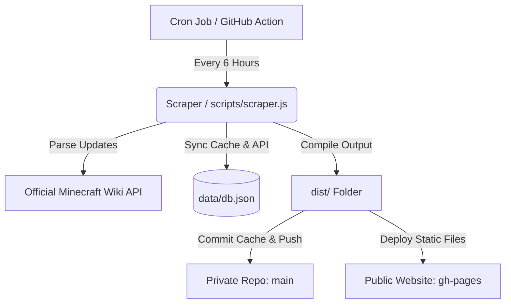

# BedrockBuilds 📦
> **Minecraft Bedrock Dedicated Server Archive & High-Performance Static REST API.**

Welcome to **BedrockBuilds**! A stark, neubrutalist developer-focused platform designed to archive official Minecraft Bedrock Edition Dedicated Server binaries and expose them through a zero-rate-limit serverless REST API. 

The architecture is built completely **serverless** and static, utilizing a smart Node.js crawler, local JSON database cache, and scheduled GitHub Actions to scrape, compile, and publish update records every 6 hours directly to **GitHub Pages**.

---

## 🛠️ Architecture Workflow



---

## ✨ Features

- 📂 **Grouped Accordion Database**: Historical releases are dynamically grouped by major parent versions (e.g. `1.21`, `1.20`, `26`) into a collapsible neubrutalist sidebar tree.
- ⚡ **Zero-Rate-Limit Static API**: Served completely as pre-compiled high-performance JSON files. Instant response times under any load.
- ⚠️ **Official Server Status Warning**: Prominent caution panels automatically display when preview/beta builds lack officially compiled server binaries from Mojang.
- 💻 **Zero-Dependency Local Engine**: Built-in lightweight HTTP server script running on port `3015` with native MIME type detection.
- 🔌 **Dynamic API Console Playground**: Live swagger-like interactive query console built directly into the UI featuring multi-language snippet generators (cURL, JavaScript, Python, PHP).
- 🐧 **Automatic OS Engine Detector**: Auto-detects client OS (Windows vs Linux) and serves corresponding dedicated server zip mirrors immediately on load.

---

## 🚀 How to Run Locally

You can execute, scrape, and test the entire application locally with zero global dependencies.

### 1. Installation
Clone the repository and install the sole scraping dependency (`cheerio`):
```bash
npm install
```

### 2. Start the Local Server
Boot up the high-performance zero-dependency development server:
```bash
npm run dev
```
Once started, open your browser and navigate to:
👉 **[http://localhost:3015](http://localhost:3015)**

### 3. Scrape and Sync Database
To manually fetch new version updates from the Minecraft Wiki API and update the local cache database (`data/db.json`):
```bash
npm run scrape
```

### 4. Build Production Distribution
To trigger the full pipeline (scrape latest additions, generate REST API folders, copy vector assets, and output compiled `dist/` directory):
```bash
npm run build
```

---

## 📂 Public REST API Endpoints

Once deployed on GitHub Pages, the following endpoints are publicly accessible:

### 1. Get Latest Stable Version Info
- **URL**: `https://<your-username>.github.io/bedrockbuilds/api/v1/latest.json`
- **Method**: `GET`
- **Format**:
```json
{
  "success": true,
  "last_updated": "2026-05-22T08:00:00.000Z",
  "data": {
    "version_number": "1.21.0.03",
    "update_title": "Tricky Trials Update",
    "description": "Introduces trial chambers, Breeze mob, boggs, vaults, and mace mechanics.",
    "server_version": "1.21.0.03",
    "download_urls": {
      "linux": "https://www.minecraft.net/bedrockdedicatedserver/bin-linux/bedrock-server-1.21.0.03.zip",
      "windows": "https://www.minecraft.net/bedrockdedicatedserver/bin-win/bedrock-server-1.21.0.03.zip"
    }
  }
}
```

### 2. Get All Archived Versions List
- **URL**: `https://<your-username>.github.io/bedrockbuilds/api/v1/versions.json`
- **Method**: `GET`

### 3. Get Specific Version Detail
- **URL**: `https://<your-username>.github.io/bedrockbuilds/api/v1/details/:version.json`
- **Method**: `GET`
- **Example**: `https://<your-username>.github.io/bedrockbuilds/api/v1/details/1.20.80.05.json`

---

## 🔒 Private Repository, Public Pages Deployment

You can host this project inside a secure **Private Repository** to hide your source code, crawler logic, and Github Action configurations, while keeping your website and API endpoints **100% Public**!

### Step 1: Configure Workflow Permissions
To allow GitHub Actions to commit cache changes to your `main` branch and push files to `gh-pages`:
1. Go to your GitHub repository -> **Settings** -> **Actions** -> **General**.
2. Scroll to the bottom to **Workflow permissions**.
3. Toggle **Read and write permissions** and click **Save**.

### Step 2: Trigger Initial Deployment
1. Go to the **Actions** tab of your repository.
2. Select **BedrockBuilds Automated Update & Deploy**.
3. Click the **Run workflow** dropdown on the right and trigger it manually.
4. This compiles the project and pushes it to a hidden branch named `gh-pages`.

### Step 3: Activate Public Pages
1. Go to **Settings** -> **Pages**.
2. Set **Source** to **Deploy from a branch**.
3. Under **Branch**, select **`gh-pages`** and folder **`/ (root)`**.
4. Click **Save**. Your website and public APIs will be live at `https://<username>.github.io/bedrockbuilds/`!

---

## 📜 Credits & License
- Game binaries, official download links, and assets belong to **Mojang AB** and **Microsoft**.
- Crawled statistics are fetched dynamically from the community-driven **Minecraft Wiki** API under CC BY-NC-SA 3.0 license.
- Source code is released under the **MIT License**.
# bedrockbuilds
